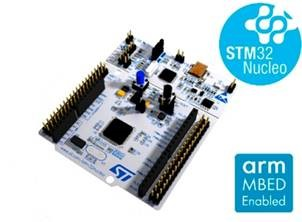
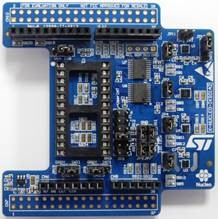
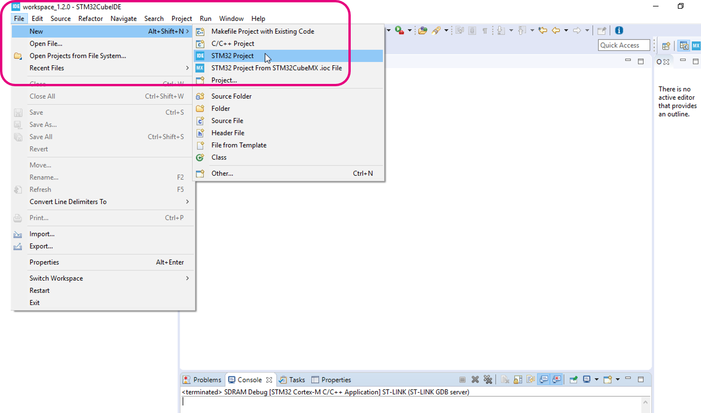

# HAR-Nucleo

This project is providing a step-by-step guide to run human activity recognition on any STM32 nucleo boards based on a Cortex M4 or M7. In addition, you will need an arduino extension shield "X-Nucleo-IKS01A3" which corresponds to motions MEMS sensors.


## Hardware requirements



A Nucleo board, in this example I will use a STM32L476-Nucleo



A motions MEMS shield X-Nucleo-IKS01A3, and finally a mini USB cable.

The expansion MEMS shield is plugged on top of the Nucleo board which is connected to your PC with mini USB cable. See the below picture for your reference.


## Software requirements

- <u>**STM32CubeIDE 1.4.0**</u>
  - Eclipse based IDE to write, build and run embedded C code on STM32 (license-free)
  - https://www.st.com/content/st_com/en/products/development-tools/software-development-tools/stm32-software-development-tools/stm32-ides/stm32cubeide.html#overview](https://www.st.com/content/st_com/en/products/development-tools/software-development-tools/stm32-software-development-tools/stm32-ides/stm32cubeide.html
- <u>**X-Cube-AI 5.1.2**</u>
  - Converter tool to map Neural Networks on STM32 in an optimized way
  - https://www.st.com/content/st_com/en/products/embedded-software/mcu-mpu-embedded-software/stm32-embedded-software/stm32cube-expansion-packages/x-cube-ai.html#overview](https://www.st.com/content/st_com/en/products/embedded-software/mcu-mpu-embedded-software/stm32-embedded-software/stm32cube-expansion-packages/x-cube-ai.html
- **<u>X-Cube-MEMS1 8.0.0</u>**
  - Library to use ST motion sensors
  - https://www.st.com/content/st_com/en/products/embedded-software/mcu-mpu-embedded-software/stm32-embedded-software/stm32cube-expansion-packages/x-cube-mems1.html#overview](https://www.st.com/content/st_com/en/products/embedded-software/mcu-mpu-embedded-software/stm32-embedded-software/stm32cube-expansion-packages/x-cube-mems1.html
- **<u>STM32F4Cube FW</u>**
  - Back-end library to use STM32 HAL & BSP (depend on your Nucleo board, the example uses F4)
  - https://www.st.com/content/st_com/en/products/embedded-software/mcu-mpu-embedded-software/stm32-embedded-software/stm32cube-mcu-mpu-packages/stm32cubef4.html

## Start & configure your project with STM32CubeIDE

**STM32CubeIDE** is based on eclipse, it's using **GNU C/C++** compiler and **GDB** debugger. It supports **ST-Link** which is the main HW interface to flash and debug embedded C code on STM32.

The ST-Link is composed by a MCU itself, you can find it on top side of the Nucleo board (near the mini USB port). You will first need to **update the ST-Link firmware** in order to flash and debug on the main STM32.

Launch **STM32CubeIDE 1.14.0**, click on **"Help"**, and on **"ST-LINK Upgrade"**.

Click on **"Open in update mode"** and finally click on **"Upgrade"**


**STM32CubeIDE** also includes **STM32CubeMX** which is a **project generation tool for STM32**. In fact, this tool provides a friendly graphical interface to initialize MCU HW peripherals, clock, pinout and middleware.  A FW is then generated and ready to use.

Any **STM32 Project** will require some **back-end** libraries. There are mainly 2 kind of back-end libraries, the **HAL** (Hardware Abstraction Layer) which are the libraries to use the core functions/peripherals of the MCU and **BSP** (Board specific components) which are the libraries to use the external component on a board (external memories, LCD, camera...). Those libraries are included inside the **STM32CubeF4 FW** which is a SW requirement in order to use STM32CubeIDE.

We will link the zip file STM32CubeF4 which you downloaded during the SW prerequisites, on STM32CubeIDE as follow :

Click on **"Help"** menu, and on **"Manage Embedded Software Packages"**


Click on **"From Local..."** *(bottom left)* and select your **zip** file, then click on **"Install Now"**  *(bottom right)*


The installation process would take around 5 minutes.

Next, you can install **X-Cube-MEMS1** and **X-Cube-AI** over this same process.

Switch to **"STMicroelectronics"** tab, click on **"From Local..."** and select the file **"STMicroelectronics.X-CUBE-AI.5.1.2.pack"** *(see below picture)*.


**Caution point**, for **X-Cube-MEMS1**, you cannot install it from a local file *(known internal bug)*. You will need an **internet connection** to do an online installation. Select the latest version of X-Cube-MEMS1 and click on **"Install Now"** as shown below


As it will download 100 MB of files, it may take some time.

After these installation steps, you can start the first part of this workshop, where you will get familiar with CubeIDE & CubeMX tools.

1. With STM32CubeIDE 1.14.0 software, start a **new STM32 Project** as described below:



2. Enter your board **part number** *(make sure you select a nucleo board)*

   

   

3. Give a **name** to your project and click on "next"

   

   

   

4. Check that you will use the latest STM32Cube FW *(for F4 it's 1.25)*. Then, click on **"finish"** to complete project creation. If you got a window saying if you want to initialize the **peripheral by default ?** click on **"No"**.

   In fact, STM32CubeMX tool can help you to initialize a new project, but during this workshop, you will learn to do it by yourself.

   

   


## HW & SW configurations with STM32CubeMX

As mentioned before, STM32CubeMX is a project configuration tool, you can set all the HW and SW components which will be used by your STM32 board. You can also find a standalone version of this tool which can generate project for other IDE *(Keil & IAR)*.

1. We will start by tuning the **MCU clock** at this highest value. Click on **"Clock Configuration"**.

   

2. Increase the **HCLK** at highest value depend on your Nucleo board (80 MHz for Nucleo L476 and 180 MHz for a F446 Nucleo)


3. 
   In this part, we will initialize the **USART** in order to enable a communication between the PC and the STM32. First, let's check in the **user manual** of your Nucleo board about the USART used to support **virtual COM port** between PC & STM32.
   - Nucleo-64
     - *https://www.st.com/resource/en/user_manual/dm00105823-stm32-nucleo64-boards-mb1136-stmicroelectronics.pdf*
   - Nucleo-144
     * *https://www.st.com/resource/en/user_manual/dm00244518-stm32-nucleo144-boards-stmicroelectronics.pdf*

As you can find in the user manual, the **USART2** (pin **PA2 & PA3** of the MCU) is connected to **ST-Link** to support **virtual COM port**.


So, we need to enable **USART2** and assign his pins on **PA2** and **PA3** of the STM32. This can be done on STM32CubeMX tab **connectivity**, as follow:


4. Enable SW packages **X-Cube-AI** & **X-Cube-MEMS1** for your project.

   **Caution point**, when you will enable X-Cube-AI, it would **download and install some additional files**, thus you need an **internet connection** before doing the below steps. This installation will require some time, as it will download and install around **1GB** of additional files. In the meantime, you can continue with the next section 5.


<u>**Reminder:**</u>

**X-Cube-AI core** is the code generator tool which can read an input pre-trained model from any framework (Keras, TF Lite, ONNX) , and then generate the C-library (or AI C-model). The **ApplicationTemplate** is a top-level code template to show you how to use the AI C-library.


5. In this part, the peripheral **I2C** is used as communication interface between the motion sensor and the MCU. We will initialize this peripheral following the pins mapping of Nucleo board and the motion mems shield.

   Check out how the **I2C** is available on the IKS01A3 expansion shield user manual

   - *https://www.st.com/resource/en/user_manual/dm00601501-getting-started-with-the-xnucleoiks01a3-motion-mems-and-environmental-sensor-expansion-board-for-stm32-nucleo-stmicroelectronics.pdf*


​		Now, check which **STM32 PINs** are available on the PINs **P9** & **P10** of the connector **CN5**.

- Nucleo-64

  - *https://www.st.com/resource/en/user_manual/dm00105823-stm32-nucleo64-boards-mb1136-stmicroelectronics.pdf*

- Nucleo-144

  - *https://www.st.com/resource/en/user_manual/dm00244518-stm32-nucleo144-boards-stmicroelectronics.pdf*

  

  From the information collected on these user manual, in **STM32CubeMX**, we have to enable **I2C1 on PB8 and PB9 of the MCU**.

  

6. Configure your **I2C1 peripheral** in your project, go on tab **"Connectivity"**


7. In this section, we will enable the **"interruption mode"** 

Check out how the external interrupt mode is available on the IKS01A3 expansion shield user manual *(for the LSM6DSO sensor)*

- *https://www.st.com/resource/en/user_manual/dm00601501-getting-started-with-the-xnucleoiks01a3-motion-mems-and-environmental-sensor-expansion-board-for-stm32-nucleo-stmicroelectronics.pdf*


​	Check in the Nucleo user manual, which **GPIO** is available on the **PIN5** of the connector **CN9**.

- Nucleo-64
  - *https://www.st.com/resource/en/user_manual/dm00105823-stm32-nucleo64-boards-mb1136-stmicroelectronics.pdf*
- Nucleo-144
  - *https://www.st.com/resource/en/user_manual/dm00244518-stm32-nucleo144-boards-stmicroelectronics.pdf*


Now, go back to your project and enable the **GPIO PB5** in **"GPIO_EXTI5"** mode *(15)*. Configure it on **"System Core"**, click on **GPIO** and verify the right mode **"external interrupt mode with rising edge trigger detection"**.


Finally, click on **NVIC** tab and enable the interrupt controller on **EXTI line[9:5] interrupts** *(16)*


8. In this last part, you will configure the SW libraries: **X-Cube-AI** & **X-Cube-MEMS1**. As reminder, X-Cube-MEMS1 is a high-level library which will provide the **functions to use the motion sensor**, and X-Cube-AI is the high-level library which will provide the **functions to run neural network model** on STM32.

Click on **"Additional software"** and start with **X-Cube-MEMS1** *(17)*, at this stage, you first need to **check "Board Extension MEMS"** to enable the library for the expansion shield. Then, click on **"Platform Setting"** and select **I2C1** *(18)*.


​	X-Cube-AI is our converter tool to map neural network on STM32 in an optimized way. You will need a pre-trained model file to use this tool. Please find in this git repository, a pre-trained model ***"Utilities/AI_resources/cnn_gmp.h5"***. This model has been trained using Keras framework.

You can upload this model into your project as follow:


At this stage, all the **HW & SW configurations are done**. You can generate the software code and start using it.


## Write your application code to use the sensor

In this part, we will handle the software library **X-Cube-MEMS1** generated in the previous section with **STM32CubeMX**. In fact, this library offers several functions to configure your sensor (frequency rate, value scaling, mode...)

Let's first have a look to the code generated:

 

You can notice that in the `main.c` file, there are some section with `USER CODE BEGIN...` and `USER CODE END...`, you should write your code between these sections. Because, when you will need to regenerate some code from **STM3CubeMX**, only the **user code** written between these sections will be saved.

***Moreover, in all the next coming parts of this guide, you will need to write and add code snippets. Code sections and approximative line are given as indications for you to write your code at the right place. Please be careful on these indications.*** 


1. You can start by **building** the project to make sure that generated code is not raising any compilation error(s).


Add the **"headers"** files in the `main.c` file in order to import the libraries.

*Please note that the `app_x-cube-ai.h` is the entry point for `network.h` and `network_data.h` which both are the files representing your neural network.*

In section `USER CODE BEGIN Includes` *(line ~ 27)*

```c
#include "iks01a3_motion_sensors_ex.h"
#include "stdio.h"
```


Add your **variables** to deal with the sensor.

In section `USER CODE BEGIN PV` *(line ~50)*

```c
IKS01A3_MOTION_SENSOR_Axes_t acc_axes;
volatile uint32_t FlagDataReceived;
```


`acc_axes` represents the structure containing acceleration data on x, y and z axis.

`FlagDataReceived` is a flag that will indicate when data has been read.


2. Write the `MEMS_Init()` function

First, declare prototype of this function *(line ~77, at section `USER CODE BEGIN PFP`)*:

```c
static void MEMS_Init();
```


Then, write this function which will configure and enable the **LSM6DS0** sensor to read acceleration data at **26 Hz**, with a value range between **-4000 mg and +4000 mg**. It's also using the **interrupt mode**.

*(write the following code snippets at section `USER CODE BEGIN 4` , line ~266)*

```c
/* USER CODE BEGIN 4 */

static void MEMS_Init(){

/* Link BSP function to IKS01A3 API and initialize sensor LSM6DSO */
 IKS01A3_MOTION_SENSOR_Init(IKS01A3_LSM6DSO_0, MOTION_ACCELERO);
 uint8_t id;
 IKS01A3_MOTION_SENSOR_AxesRaw_t axes;

/* Read sensor ID, and validate initialization */
 if(IKS01A3_MOTION_SENSOR_ReadID(IKS01A3_LSM6DSO_0, &id) != BSP_ERROR_NONE){
 	printf("Error sensor ID \n\r");
 	while(1);
 	}
/* Set output data rate (accelerometer frequency), and value range between [-4000 mg; +4000 mg]  */
	IKS01A3_MOTION_SENSOR_SetOutputDataRate(IKS01A3_LSM6DSO_0, MOTION_ACCELERO, 26.0f);
	IKS01A3_MOTION_SENSOR_SetFullScale(IKS01A3_LSM6DSO_0, MOTION_ACCELERO, 4);
/* Enable interrupt mode on pin INT1 */
	if(IKS01A3_MOTION_SENSOR_DRDY_Enable_Interrupt(IKS01A3_LSM6DSO_0,MOTION_ACCELERO,
					 	IKS01A3_MOTION_SENSOR_INT1_PIN) != BSP_ERROR_NONE) {
		printf("Error sensor interrupt setting \n\r");
		while(1);
	}
/* Read data to clear the DRDY (interrupt flag) */
	IKS01A3_MOTION_SENSOR_GetAxesRaw(IKS01A3_LSM6DSO_0, MOTION_ACCELERO, &axes);
/* Enable the accelerometer and ready to use it*/
	IKS01A3_MOTION_SENSOR_Enable(IKS01A3_LSM6DSO_0, MOTION_ACCELERO);
}
/* end function */
```


Add the **callback function** which is called each time when data is read. A flag is updated in this callback function.

```c
void HAL_GPIO_EXTI_Callback(uint16_t GPIO_Pin){

	if(GPIO_Pin == GPIO_PIN_5){
		FlagDataReceived++;
	}

}
```

Add `_write()` function to point the `printf` function to the serial terminal interface *(USART2)*.

```C
int _write(int fd, char* buffer, int len){

	HAL_UART_Transmit(&huart2, (uint8_t *) buffer, len, HAL_MAX_DELAY);

}
/* USER CODE END 4 */
```


3. Go to the **main** function to write your application code (line ~87)

Update the following code snippet:

```C
  /* USER CODE BEGIN 2 */
  FlagDataReceived = 0;
  MEMS_Init();
  /* USER CODE END 2 */

  /* Infinite loop */
  /* USER CODE BEGIN WHILE */
  while (1)
  {
    /* USER CODE END WHILE */
// comment this function as we do not need it
//  MX_X_CUBE_AI_Process();

	  if(FlagDataReceived !=0){
		  FlagDataReceived = 0;
		  IKS01A3_MOTION_SENSOR_GetAxes(IKS01A3_LSM6DSO_0, MOTION_ACCELERO, &acc_axes);
	  }

	  /* USER CODE BEGIN 3 */
  }
  /* USER CODE END 3 */
}
```

Each time when the data flag is updated in the callback, we will request **new acceleration data reading**.

You can now, **compile** your project and run the **debug** mode.


Launch the debug mode **"STM32 Cortex-M C/C++ Applications"**


Confirm the change of perspective as you will move to the debug menu


In this mode, you can watch the variable `acc_axes` where the acceleration data is stored, thanks to the **"Live Expressions"** feature.


Finally, **run** the debug mode as indicated below, and check the **data** on **"Live Expressions"** menu. If you shake your board, the values should change.


At this stage, the sensor is well linked with the STM32, the 2 HW (Nucleo F446 & expansion shield IKS01A3) are working together. Acceleration data is being read from the sensor LSM6DSLO. In the next step, we will see how to call a neural network inference on STM32.


## Write you application code to run AI model inference on STM32


1. Add the following variables in the `USER CODE BEGIN PV` section *(line ~49)*

```C
float ai_in[AI_NETWORK_IN_1_SIZE];
float ai_out[AI_NETWORK_OUT_1_SIZE];

const char* activities[AI_NETWORK_OUT_1_SIZE] = {
		  "stationary", "walking", "running", "driving", "cycling"
};

/* USER CODE END PV */
```

The variable `ai_in` represents the input buffer data which will store all the acceleration data. The `ai_out` is the output buffer which will store the neural network output (after running an inference). 

Next, we will use a variable `data_idx` to count the number of data stored inside `ai_in`. The idea is to check the size of this buffer, and run an inference when the buffer is fulfilled.

Add the variable `data_idx` in the section `USER CODE BEGIN 2` *(line ~110)* as follow :

```C
  /* USER CODE BEGIN 2 */
  FlagDataReceived = 0;
  MEMS_Init();
  uint8_t data_idx = 0;
  /* USER CODE END 2 */
```


2. In your **main loop**, you can complete your code to store the data inside the `ai_in` buffer and run AI inference.

`MX_X_CUBE_AI_PROCESS();` is a function generated by STM32CubeMX. The main purpose of this function is to run the AI inference using an input buffer with random values. As we do not need this function in our application, you should comment it.

```C
 /* Infinite loop */
  /* USER CODE BEGIN WHILE */
  while (1)
  {
    /* USER CODE END WHILE */
// comment this function as we do not need it
//  MX_X_CUBE_AI_Process();

	  if(FlagDataReceived !=0){
		  FlagDataReceived = 0;
		  IKS01A3_MOTION_SENSOR_GetAxes(IKS01A3_LSM6DSO_0, MOTION_ACCELERO, &acc_axes);
	  /* Normalization between -1 and +1 */
		ai_in[data_idx + 0] = (float) acc_axes.x / 4000.0f;
		ai_in[data_idx + 1] = (float) acc_axes.y / 4000.0f;
		ai_in[data_idx + 2] = (float) acc_axes.z / 4000.0f;
      /* Check if buffer is full */    
        if(data_idx == AI_NETWORK_1_SIZE){
           data_idx = 0;
           printf(\r\n Running AI inference \r\n);
            /* Run AI inference - check if the inference doesn't occur any error */
           if(aiRun(ai_in, ai_out) != 0){
           		printf("Error when running AI inference");
		   		while(1);
        	}
            /* send NN output to the serial terminal */
            for(uint32_t i=0; i < AI_NETWORK_OUT_1_SIZE; i++)
                printf(" %s : %.3f", activities[i], ai_out[i]);
      	  }  
         data_idx++; 
       }
	  /* USER CODE BEGIN 3 */
  } /* end while loop */
  /* USER CODE END 3 */
} /* end main function */
```

In this loop, the first condition `if` is checking whenever we **received acceleration data**. The second condition `if` is checking whenever the **input buffer is complete** and then we can run an inference. Finally, the third condition `if` is validating that the **inference is running** without any error(s).


3. Now, you can **build** your project and **run** it on the target as follow:


Once you got the following message `Download verified successfully` in the console, it means that the code has been well flashed on board. You can open a **serial terminal** to check the **NN output**. STM32CubeIDE is providing such tool *(see on bottom right side)*.


Then, **configure** you serial terminal as follow:


If you can see the activities in the terminal console, it means your code is working well.

**Congratulation! At this stage, you successfully achieved this workshop! :)**